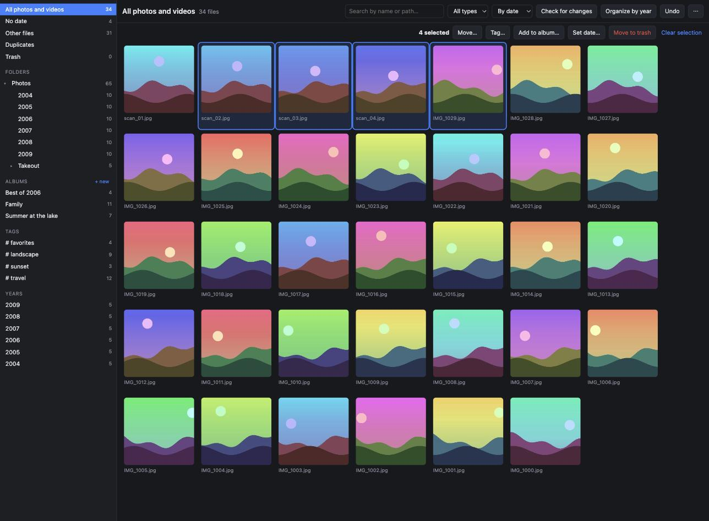

<h1 align="center">Yearfold</h1>

<p align="center">
  <strong>Bring your photos home and put them in order.</strong><br>
  A desktop app that turns a messy photo export into a tidy library on your own disk.
</p>

<p align="center">
  <a href="https://github.com/sjakovic/yearfold/actions/workflows/ci.yml"></a>
  <a href="LICENSE"></a>
  
  
</p>



## What it does

Yearfold organizes the photos and videos in a folder on your disk. It indexes
every file in the folder, lets you browse, tag and group them into albums, and
moves them into year folders (`2004/`, `2005/`, `2006/` …) when you ask it to.
It reads Google Takeout exports, including the dates stored in their JSON
files. Your photos stay ordinary files in ordinary folders.

## Features

- **Indexes everything** - every file under the folder you pick, including the
  ones that are not photos, so nothing is hidden from you.
- **Organize by year** - preview exactly what will move where, then move dated
  photos and videos into year folders. Keep the folder names you already have
  (`2005/Trip to Rome/`), or go flat (`2005/`) or by month (`2005/03/`).
- **Understands Google Takeout** - reads dates, locations, descriptions and
  people from the JSON sidecars, including Takeout's truncated and numbered
  file names. One action merges that data into the library, writes missing
  dates into the photos and clears the JSON files away.
- **Albums and tags that never move a file** - they live in the library index.
  A photo stays in its album when you move it to another folder.
- **Real moves when you want them** - move photos to any folder inside the
  library; sidecar files travel with them.
- **Fix missing dates** - set a capture date on one photo or many. JPEG and
  PNG get it written into the file (EXIF) with every other tag left intact;
  other formats and videos keep it in the library.
- **Duplicates by content** - found by SHA-256 of the file, not by name.
- **Check for changes** - after you add or rearrange files outside the app,
  review what is new, changed, missing or moved before the index is updated.
  Files moved in Finder or Explorer keep their tags and albums.
- **Hard to lose anything** - delete goes to a library trash you can restore
  from, and the last move or delete can be undone.
- **All the metadata** - EXIF, IPTC and XMP for every photo, in one panel.
- **Fast with big libraries** - virtualized grid, thumbnails generated on
  demand, metadata and hashes computed in the background.
- **English and Serbian (Cyrillic)** interface.

## How it treats your files

Yearfold does not change your photos on its own. Only actions you start touch
the disk:

| Action | What happens on disk |
|---|---|
| Add to album, tag | Nothing. Stored in the index. |
| Move, Organize by year | Files are moved inside the library folder. Undoable. |
| Move to trash | Files go to the library trash. Restorable until you empty it. |
| Set date | JPEG/PNG: the date is written into the file. Other formats: nothing. |
| Merge Google Takeout data | Missing dates are written into JPEG/PNG; JSON files go to the trash. |

Everything Yearfold knows lives next to your photos:

```
Photos/
├── 2004/
├── 2005/
├── …
└── .yearfold/          hidden
    ├── library.db      index: files, tags, albums, dates, undo history
    ├── thumbs/         thumbnail cache, safe to delete
    └── trash/          deleted files until you empty the trash
```

Paths in the index are relative to the library folder, so a library on an
external disk - or copied to another computer - opens with its tags and albums
intact. App settings (recent folders, language) are kept separately in the
operating system's config directory.

## Getting started

Download the build for your system from the
[latest release](https://github.com/sjakovic/yearfold/releases/latest):

| System | File |
|---|---|
| macOS (Apple silicon and Intel) | `Yearfold-macos.zip` |
| Windows | `Yearfold-windows-amd64.exe` |
| Linux | `Yearfold-linux-amd64.tar.gz` |

The builds are not signed. On macOS, right-click the app and choose **Open**
the first time; on Windows, choose **More info → Run anyway**. The Linux build
needs GTK 3 and WebKitGTK 4.0. Day-to-day development and testing happen on
macOS.

To build it yourself you need [Go](https://go.dev) 1.25+,
[Node.js](https://nodejs.org) 20+ and the
[Wails v2 CLI](https://wails.io/docs/gettingstarted/installation):

```sh
git clone https://github.com/sjakovic/yearfold.git
cd yearfold
wails build
```

The app is created in `build/bin`.

Video thumbnails work out of the box on macOS (via Quick Look). On Windows and
Linux they need `ffmpeg` on the `PATH`; without it videos show an icon.

### A typical Takeout clean-up

1. Unpack the Takeout archives into one folder and open it in Yearfold.
2. Wait for the status bar to finish reading metadata and computing hashes.
3. Open **Duplicates**, keep one copy of each photo and trash the rest.
4. Run **Merge Google Takeout data…** from the `⋯` menu.
5. Open **No date**, select photos you can place in time and **Set date…**.
6. Click **Organize by year**, check the preview and confirm.

Try it on a copy of a small part of your library first.

## Development

```sh
wails dev                      # run with live reload
go test ./...                  # backend tests
golangci-lint run ./...        # backend lint
cd frontend && npm test        # frontend tests
cd frontend && npm run lint    # frontend lint
```

```
main.go                entry point
internal/app           the API the UI calls
internal/library       one open library: scanning, metadata, dates, Takeout
internal/store         SQLite index; the only package that talks to the database
internal/scanner       compares the disk with the index
internal/fileops       move, trash, restore, undo
internal/organize      plans moves into year folders
internal/meta          reads metadata and Takeout sidecars, writes dates
internal/thumbs        thumbnail cache
internal/assets        serves thumbnails and originals to the webview
internal/settings      per-user preferences
frontend/src
  components/          React components, dialogs in components/dialogs
  context/             state of the open library, notifications
  hooks/               data loading, selection, backend events
  lib/                 API bindings, translations, helpers
```

The project follows [Semantic Versioning](https://semver.org/). The version
lives in `wails.json` (`info.productVersion`), is embedded into the binary and
shown in the app menu. Changes are recorded in [CHANGELOG.md](CHANGELOG.md).

## License

[MIT](LICENSE) © Simo Jaković
